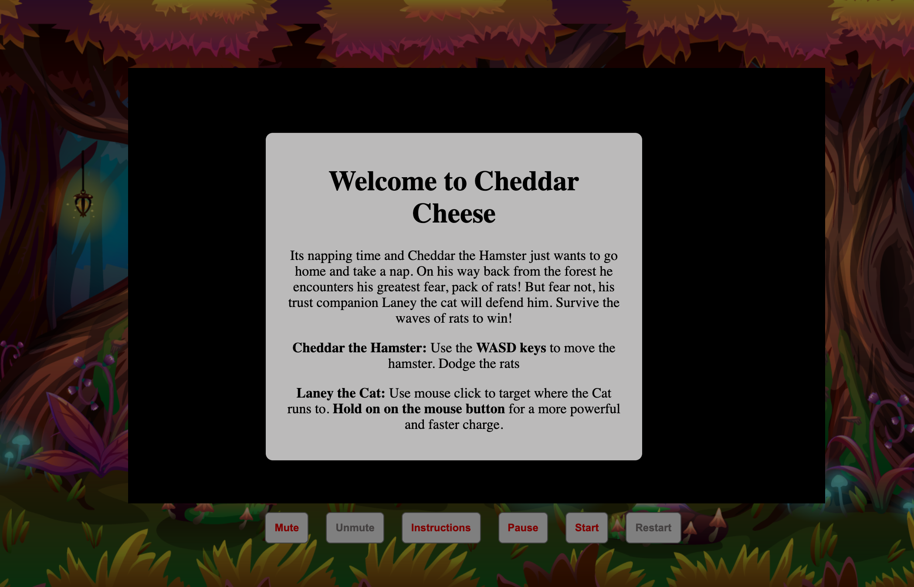

# Cheddar Cheese

[live game](https://msong793y.github.io/fscheddarcheese/)

## Description:

Cheddar Cheese is a 2D action survival game built using Object Oriented Programming javascript, canvas, webpack. The player takes control of two entities, a hamster and a cat. The hamster is controlled by AWSD keys on the keyboard while the cat is controlled by the mouse. 

Waves of enemies rodent will seek to damage the hamster's health, while the cat is able to eliminate the enemy with out taking damage. The goal of the game is to survive until all of the enemies are eliminated. 

## Features

* Player is able to start the game.
* The hamster takes damage when collided into enemies.
* The cat eliminates enemies upon impact.
* Gray enemies move in direction.
* Brown enemies chase after the hamster.
* Player is notified of game termination condition.
* Player can pause and unpause game.
* Player can mute and unmute the sound.

## Screenshots

Landing page/ directions modal:


Game in Progress:


Game upon termination: 


## Code Snippets:

* Rendering Moving Objects:

```javascript
const NORMAL_FRAME_TIME_DELTA = 1000 / 60;

MovingObject.prototype.move = function move(timeDelta) {
const velocityScale = timeDelta / NORMAL_FRAME_TIME_DELTA,
        offsetX = this.vel[0] * velocityScale * this.speed*this.multiplier,
        offsetY = this.vel[1] * velocityScale * this.speed*this.multiplier;

    let x = this.pos[0] + offsetX;
    let y = this.pos[1] + offsetY;
    if (x > 800 || x < 0) {
        this.vel[0] = -(this.vel[0])
    }

    if (y > 500 || y < 0){
        this.vel[1] = -(this.vel[1] )
    }
    this.pos[0] = x;
    this.pos[1] = y;


};
```

* Checking if one object is in range of another:

```javascript
//checking to see if object is in range:
Game.prototype.checkInRange = function () {
    const sloth = this.sloth;
    for (let i = 0; i < this.homingMouse.length; i++) {
        
        const hMouse = this.homingMouse[i];
        if (hMouse.isInRangeOf(hMouse.range,sloth)) {
            hMouse.retarget(sloth)
        }
    }
}
```

*Checking for collision: 

```javascript
Game.prototype.checkCollisions=function(){
    const sloth = this.sloth;
    const cat = this.cat;
    for(let i = 0; i<this.enemies.length; i++){
        // debugger
        const object = this.enemies[i];
        if (sloth.isCollidedWith(object)){
           
            sloth.takeDamage(object.attack)
            if (this.soundActive===true){
            sloth.ouchSound.play();
            }
        }
        if (cat.isCollidedWith(object)) {

            object.takeDamage(cat.attack*cat.speed)
        }
    }
}
```


## Future Implementations:

* Add more types of enemies with different behaviors.
* Add power ups and other boosters.
* Add levels and more story narratives.